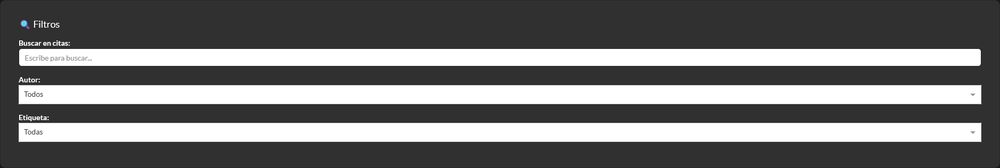
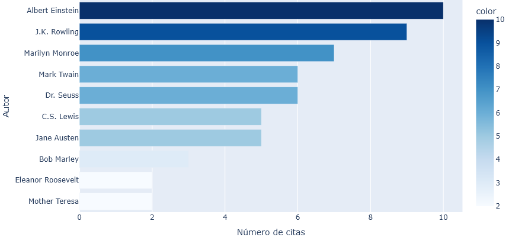
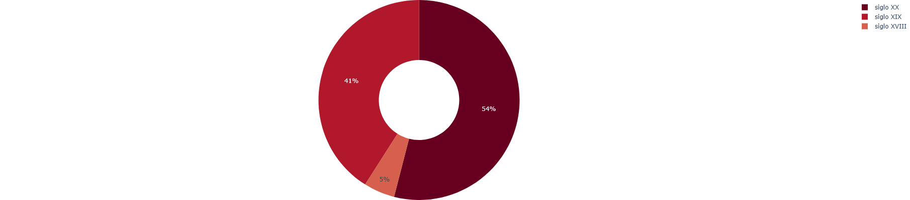
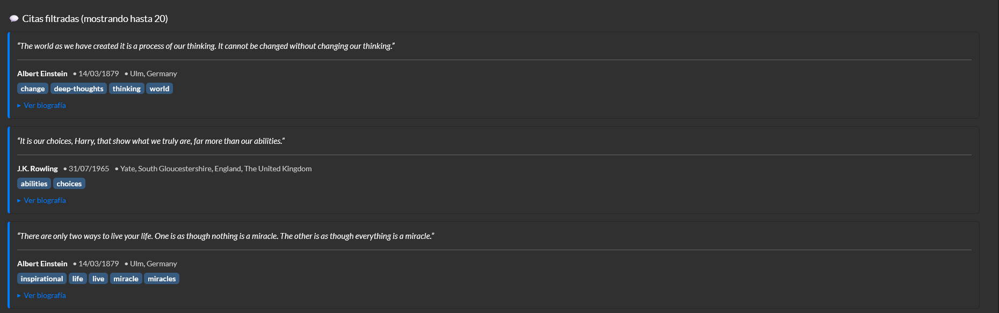
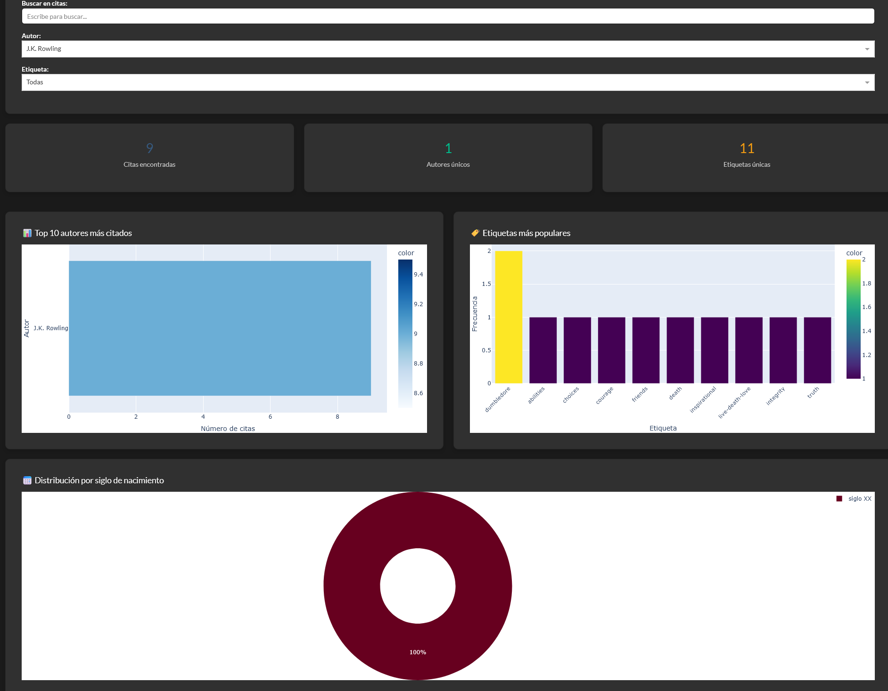
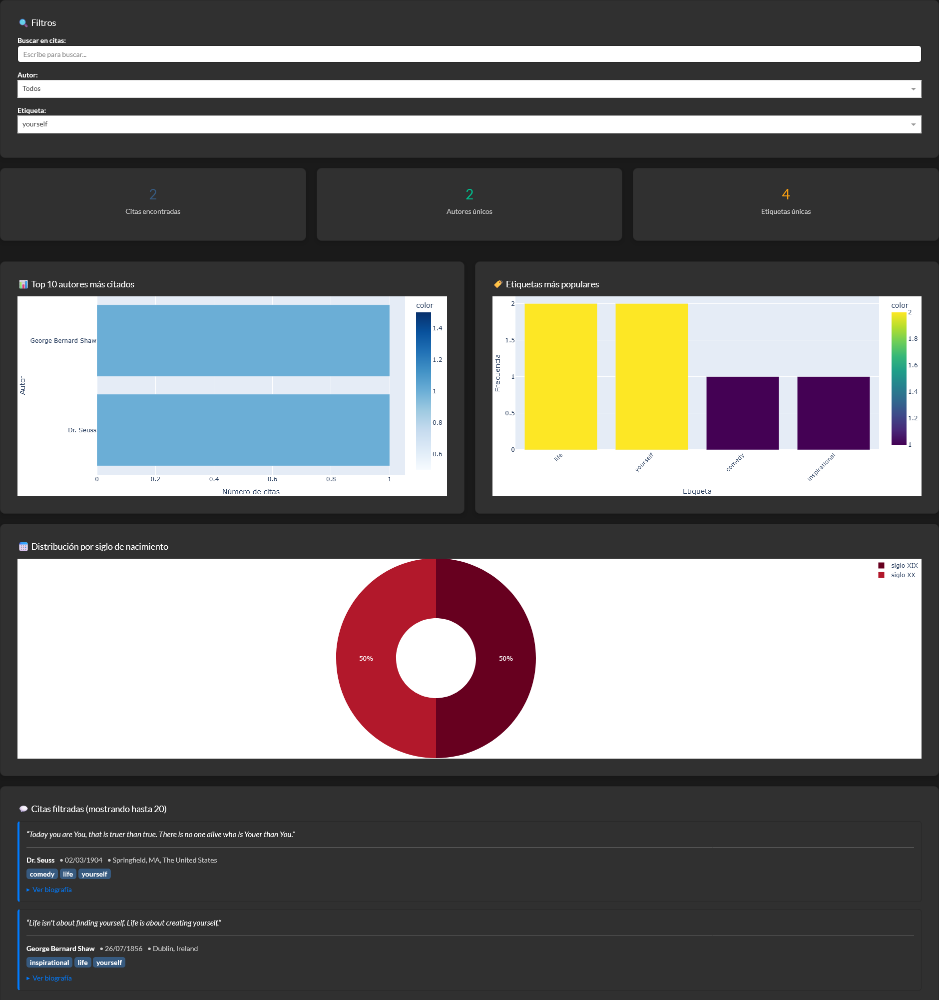

# 📚 Dashboard de citas de personajes famosos

Dashboard interactivo para visualizar y analizar citas de personajes famosos extraídas mediante web scraping.


## ✨ Características

- 🔍 **Búsqueda en tiempo real** - Filtra citas por texto
- 👤 **Filtros por autor** - Visualiza citas de autores específicos
- 🏷️ **Filtros por etiquetas** - Organiza citas por temáticas
- 📊 **Visualizaciones interactivas**:
  - Top 10 autores más citados
  - Etiquetas más populares
  - Distribución por siglo de nacimiento (números romanos según nomenclatura en español)
- 🌓 **Tema claro/oscuro** - Alterna entre modos visuales
- 📱 **Diseño responsive** - Funciona en cualquier dispositivo
- 💾 **Datos persistentes** - Guarda datos en formato pickle y CSV

## 🛠️ Tecnologías utilizadas

- **Python 3.8+**
- **Beautiful Soup 4** - Web scraping
- **Requests** - Peticiones HTTP
- **Pandas** - Manipulación de datos
- **Plotly** - Gráficos interactivos
- **Dash** - Framework para dashboards
- **Dash Bootstrap Components** - Componentes UI

## 🧩 Retos técnicos y decisiones de diseño

1. **Lógica de Scraping:** Implementé un bucle de extracción basado en la presencia del elemento "Next" en el HTML. El script no se detiene por un número fijo de páginas, sino que detecta dinámicamente el final de la colección, lo que lo hace escalable si la web añade más citas.

2. **Transformación de Datos:** Para el gráfico de distribución histórica, desarrollé una lógica de conversión que extrae el año de nacimiento de la biografía del autor, calcula el siglo correspondiente y lo traduce a nomenclatura de los siglos en español basado en números romanos, asegurando una visualización académica y profesional.

3. **Arquitectura de Datos:** Opté por un sistema de guardado dual. Utilizo archivos Pickle (.pkl) para mantener la integridad de los tipos de datos de Python (listas de etiquetas) para el Dashboard, y CSV para garantizar la portabilidad y facilitar el análisis externo en herramientas como Excel o Power BI.

## 👁️ Visualización
<details>
  <summary>📸 Haz clic aquí para ver las capturas de pantalla</summary>
  <br>
  
  
  
  
  
  
  <br>
  </details>

## 📋 Requisitos previos

- Python 3.8 o superior
- pip (gestor de paquetes de Python)

## 🚀 Instalación

1. **Clona el repositorio**
```bash
git clone https://github.com/RualGF/Prueba-de-WebScraping.git
cd '.\Prueba de WebScraping\'
```

2. **Crea un entorno virtual (recomendado)**
```bash
python -m venv .venv

# En Windows
.venv/Scripts/activate

# En Linux/Mac
source .venv/bin/activate
```

3. **Instala las dependencias**
```bash
pip install -r requirements.txt
```

## 💻 Uso

### 1. Extraer datos (scraping)

Primero, ejecuta el script de scraping para obtener las citas:

```bash
python scraping.py
```

Esto creará dos archivos:
- `quotes_data.pkl` - Datos para el dashboard
- `quotes_data.csv` - Datos en formato CSV para análisis externo

**Salida esperada:**
```
============================================================
🚀 INICIANDO SCRAPING DE CITAS
============================================================

📄 Sacando citas de la página 1...
✓ Página 1 completada (10 citas)
...
🏁 No hay más páginas. Extracción completada.

============================================================
✅ SCRAPING COMPLETADO
============================================================
📊 Total de citas extraídas: 100
👥 Autores únicos: 50
🏷️ Etiquetas únicas: 75

💾 Datos guardados en:
   - quotes_data.pkl (para el dashboard)
   - quotes_data.csv (para análisis externo)
============================================================
```

### 2. Visualizar datos (dashboard)

Una vez extraídos los datos, ejecuta el dashboard:

```bash
python dashboard.py
```

Abre tu navegador en: **http://127.0.0.1:8050**

Para detener el servidor: `Ctrl+C`

## 🎯 Funcionalidades del dashboard

### Filtros
- **Búsqueda**: Escribe cualquier palabra para buscar en citas o autores
- **Autor**: Selecciona un autor específico del dropdown
- **Etiqueta**: Filtra por temática (en inglés, como en la página original)

### Métricas
- Total de citas encontradas
- Número de autores únicos
- Cantidad de etiquetas únicas

### Gráficos
- **Autores más citados**: Gráfico de barras horizontal
- **Etiquetas populares**: Gráfico de barras vertical
- **Distribución por siglo**: Gráfico circular con siglos en números romanos

### Lista de citas
- Muestra hasta 20 citas filtradas
- Información del autor (fecha y lugar de nacimiento)
- Etiquetas asociadas
- Biografía desplegable

## 📁 Estructura del proyecto

```
quotes-dashboard/
│
├── scraping.py              # Script de extracción de datos
├── dashboard.py             # Aplicación del dashboard
├── requirements.txt         # Dependencias del proyecto
├── README.md                # Este archivo
│
├── quotes_data.pkl         # Datos extraídos (generado)
└── quotes_data.csv         # Datos en CSV (generado)
```

## 🐛 Solución de problemas

### Error: "No se encontró el archivo 'quotes_data.pkl'"

**Solución**: Ejecuta primero `python scraping.py` para generar los datos.

### Error: "ModuleNotFoundError: No module named '...'"

**Solución**: Instala las dependencias con `pip install -r requirements.txt`

### El dashboard no carga

**Solución**: 
1. Verifica que el puerto 8050 no esté ocupado
2. Prueba cambiar el puerto en `dashboard.py`:
   ```python
   app.run(debug=False, port=8051)  # Cambia 8050 por otro puerto
   ```

### Los iconos de tema no se ven

**Solución**: Asegúrate de tener conexión a internet (Font Awesome se carga desde CDN).

Alternativa: Usa emojis en lugar de iconos en `dashboard.py`:
```python
icon = "🌙"  # En lugar de html.I(className="fas fa-moon")
icon = "☀️"  # En lugar de html.I(className="fas fa-sun")
```

## 📊 Datos recopilados

El scraping extrae la siguiente información de cada cita:

- **quote**: Texto de la cita
- **author**: Nombre del autor
- **tags**: Lista de etiquetas temáticas
- **author_about**: Biografía del autor
- **author_birthdate**: Fecha de nacimiento
- **author_birthplace**: Lugar de nacimiento

---

🚀 Caso de estudio técnico: Pipeline de extracción y visualización de datos dinámicos.
